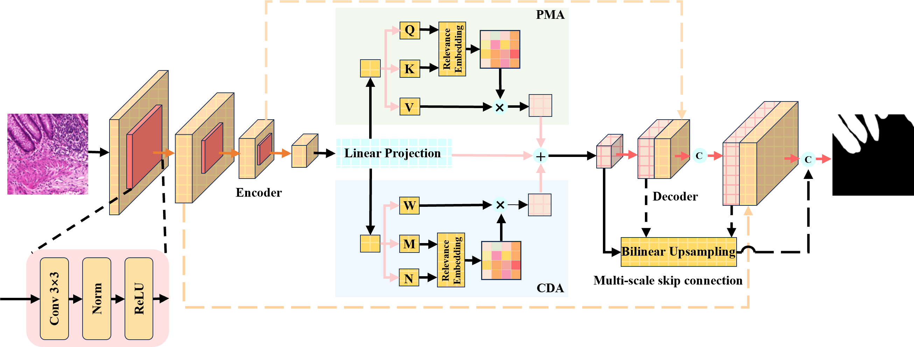
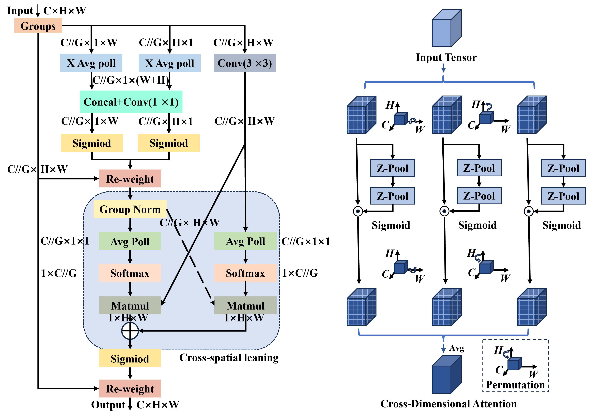
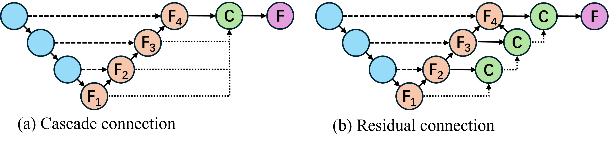
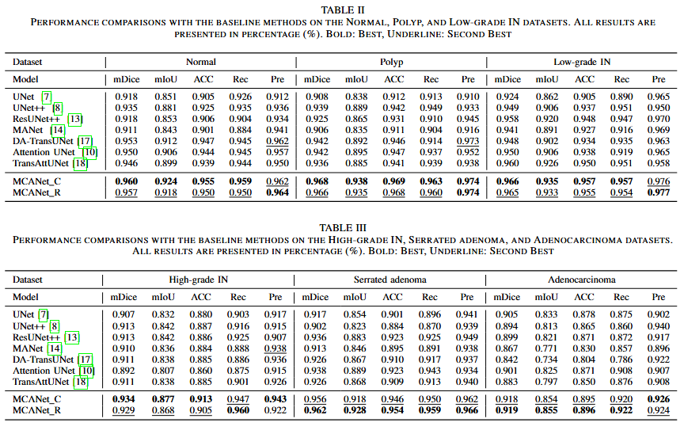
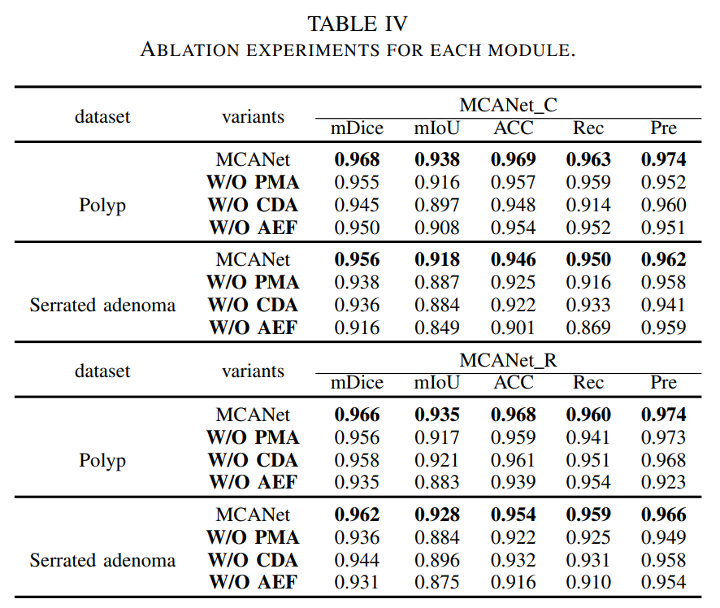
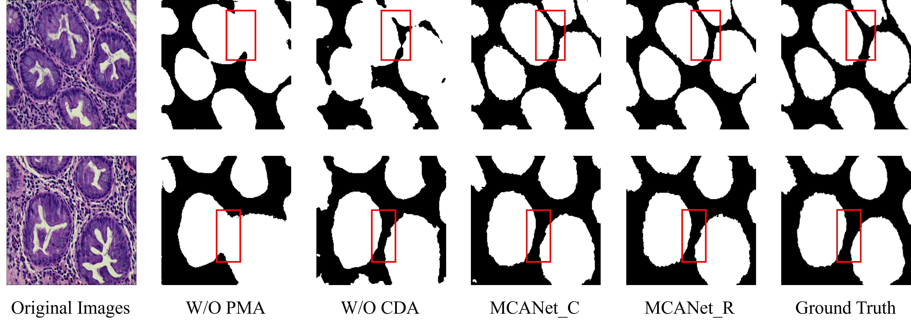

# MCANet

This is the official repository of **Multi-Scale Cross-Dimensional Attention Network for Gland Segmentation.**

# Prepare data
Detailed data is available [here](https://figshare.com/articles/dataset/EBHISEG/21540159/1?file=38179080). This dataset, named EBHISEG, is a publicly available breast histopathology benchmark released on Figshare by domain experts. All glandular segmentation annotations were conducted and verified by experienced pathologists. As a curated open-access dataset, the ethical approvals, annotation protocols, and inter-rater reliability assessments were managed and ensured by the original authors prior to publication. Therefore, our study directly builds upon this validated and ethically approved resource without involving additional human subject data collection.

### Dataset descriptions
We conduct extensive experiments to evaluate the performance of our model using six real-world datasets: Normal, Polyp, Low-grade IN, High-grade IN, Serrated adenoma, and Adenocarcinoma. As shown in Table, these datasets contain pathological images of colorectal tissue. It includes a variety of lesion types, from normal tissue to different levels of epithelial dysplasia, polyps, serrated adenomas, and adenocarcinomas. There are a total of $4,456$ $2D$ pathological images. Each image in these datasets has a size of $224 \times 224$ pixels, and we split the data into training, validation, and test sets in a $4:4:2$ ratio.

| Class              | Train | Validation | Test | Total |
|:------------------:|:-----:|:----------:|:----:|:-----:|
| Normal            |  30   |     30     |  16  |  76   |
| Polyp             | 190   |    190     |  94  | 474   |
| Low-grade IN      | 256   |    256     | 127  | 639   |
| High-grade IN     |  74   |     74     |  38  | 186   |
| Serrated adenoma  |  23   |     23     |  12  |  58   |
| Adenocarcinoma    | 318   |    318     | 159  | 795   |

### Experimental Setup and Implementation Detail
We implement all experiments using Python $3.12.4$ and PyTorch $2.3.1$ on a server equipped with an NVIDIA GeForce RTX 4070 Ti GPU (8GB VRAM), an AMD Ryzen 7 7745HX CPU, running Windows $11$. The input image size is set to $224 \times 224$ pixels.

We employ a unified training pipeline to enable easy switching among various models by modifying configuration parameters, including classical architectures such as UNet, UNet++, ResUNet++, MANet, Transformer-based models (TransUNet, DA-TransUNet, TransAttUNet), and our proposed MCANet variants (MCANet_C, MCANet_R).

Datasets are preprocessed by resizing images and masks to $224 \times 224$, with consistent data augmentation and normalization applied using torchvision transforms. Training uses a batch size of $4$, with the Adam optimizer and an initial learning rate of $0.001$. The loss function combines Dice loss and BCE loss to better handle class imbalance in segmentation tasks.

### Training Configuration
We use `CrossEntropyLoss` (with class-specific weights and `ignore_index=0`) as the loss function. The `Adam` optimizer is adopted, with a base learning rate of `1e-3`, weight decay of `1e-4`, and momentum = `0.9`; a `StepLR` scheduler is used to adjust the learning rate. 

For data augmentation, we applied random flipping, random scaling (scale range `0.5–2.0`), cropping to the target size, and synchronized transformations via `sync_transforms.ComposeWHU`. Training was conducted with a batch size of `2` for both training and validation; `DataLoader` was configured with shuffle and drop-last options.


### Evaluation Metrics

In this paper, we evaluate the model's performance using the mean Dice coefficient (mDice), mean intersection over union (mIoU), accuracy (ACC), recall (Rec), and precision (Pre).

The definitions of the metrics are as follows:

$$
\text{mDice} = \frac{2 \times \text{TP}}{2 \times \text{TP} + \text{FP} + \text{FN}},
$$

$$
\text{mIoU} = \frac{\text{TP}}{\text{TP} + \text{FP} + \text{FN}},
$$

$$
\text{ACC} = \frac{\text{TP} + \text{TN}}{\text{TP} + \text{TN} + \text{FP} + \text{FN}},
$$

$$
\text{Rec} = \frac{\text{TP}}{\text{TP} + \text{FN}},
$$

$$
\text{Pre} = \frac{\text{TP}}{\text{TP} + \text{FP}},
$$

where TP refers to true positives, FP refers to false positives, TN refers to true negatives, and FN refers to false negatives.


# Some gland image features

Fig1. Our motivation is as follows: the heterogeneity of the glands increases the difficulty of gland segmentation. (a) Normal: normal gland tissue, (b) Low-grade IN: low-grade intraepithelial neoplasia, (c) Adenocarcinoma.

## Model Architecture
The architecture consists of the following components:

Fig2. Illustration of the proposed MCANet for gland segmentation. (a) We design parallel multi-scale attention (PMA) to precisely distinguish between the edge areas of the gland image and other areas. We also design cross-dimensional attention (CDA) to interactively model channels and spatial dimensions in complex gland images. (b) We design multi-scale skip connections to capture the local and global features of glands through cascade connection and residual connection.

### 1. **PMA**
   - We propose parallel multi-scale attention (PMA) mechanism, which preserves pixels' spatial position information through the aggregation of cross-channel and multi-scale information to more accurately distinguish the edge region from other regions of glandular images.

### 2. **CDA**
   - We propose a Cross-Dimensional Attention (CDA) mechanism that captures dependencies across the $(C, H)$, $(C, W)$, and $(H, W)$ dimensions through three separate branches. This enables interactive modeling of channel and spatial dimensions in complex gland images to improve the accuracy of gland image segmentation.

Fig3. The structure of the PMA is shown on the left, while the structure of the CDA is presented on the right.

### 3. **Multi-scale Skip Connection**
   - We design a multi-scale skip connection module to fuse features from different semantic scales. This module not only preserves detailed information but also enhances the model's contextual awareness, enabling effective extraction and fusion of both local and global information for gland image segmentation.

Fig4. The structure of the multi-scale skip connection.

# Experiment
We evaluate the effectiveness of MCANet, including MCANet\_C and MCANet\_R, to address the following research questions:
   - RQ1: Does MCANet outperform the baseline models?
   - RQ2: How do the different components of MCANet (e.g., PMA) impact the segmentation performance?
   - RQ3: Can MCANet provide accurate segmentation results?

## Performance Comparison (RQ1)

   - As shown in the figure, the segmentation effects of our model and the baseline model are compared.

## Case Study (RQ2)

Fig5. The comparison of segmentation performance on different glad datasets, where the vertical axis represents the datasets and the horizontal axis represents the methods.

## Ablation Study (RQ3)


## Installation

You can install the necessary dependencies using `pip`:

```bash
pip install torch torchvision
```

## Usage
Here is an example of how to use the MCANet for segmentation:
```bash
import torch
from MCANet_C import MCANet_C
model = MCANet_C(n_channels=3, n_classes=1)
```

```bash
import torch
from MCANet_R import MCANet_R
model = MCANet_R(n_channels=3, n_classes=1)
```

# Appendix
## Comparison Table of MCANet and Previous Architectures (Part 1)

| Feature/Method                    | UNet                     | UNet++                  | ResUNet++               | MANet                    | MCANet (Ours)                     |
|:----------------------------------:|:------------------------:|:-----------------------:|:-----------------------:|:------------------------:|:---------------------------------:|
| **Key Innovations**               | Symmetric Encoder-Decoder Network | Multi-scale Skip Connections | Residual Skip Connections | Multi-Scale Attention Mechanism | **Multi-Scale Cross-Dimensional Attention** |
| **Attention Mechanism**           | None                     | None                    | None                    | Multi-Attention Mechanism | **PMA and CDA Synergistic Dual Attention** |
| **Edge Handling**                 | Basic Convolution         | Multi-scale Information Fusion | Enhanced Boundary Detection | Focuses on Simple Gland Boundaries | **Superior Boundary Preservation** |
| **Handling of Intra-class Heterogeneity** | Limited                | Limited                 | Limited                 | Enhances Gland Heterogeneity Modeling | **Excellent via Cross-Dimensional Dependencies** |

---

## Comparison Table of MCANet and Previous Architectures (Part 2)

| Feature/Method                    | DA-TransUNet             | Attention UNet          | TransAttUNet             | MCANet (Ours)                     |
|:----------------------------------:|:------------------------:|:-----------------------:|:-----------------------:|:---------------------------------:|
| **Key Innovations**               | Transformer and Attention Mechanisms | Attention Mechanism for Focused Region Segmentation | Transformer-based Attention Mechanism | **Multi-Scale Cross-Dimensional Attention** |
| **Attention Mechanism**           | Dual Attention (Spatial and Channel) | Spatial Attention Mechanism | Multi-Level Attention Mechanism | **PMA and CDA Synergistic Dual Attention** |
| **Edge Handling**                 | Transformer for Boundary Perception | Focuses on Key Regions, struggles with blurred edges | Attention Mechanism for Boundary Refinement | **Superior Boundary Preservation** |
| **Handling of Intra-class Heterogeneity** | Models Inter-dimensional Dependencies | Improves Focus but Struggles with Intra-class Variations | Models Complex Structures through Attention | **Excellent via Cross-Dimensional Dependencies** |

<!-- 
## Performance comparisons with the baseline methods on the Serrated adenoma and Adenocarcinoma datasets. Based on the results of the paired T-test, use ✓ ($\times$), respectively, to indicate that MCANet\_C is significantly better (worse) than the corresponding methods.
<table>
  <thead>
    <tr>
      <th rowspan="2">Model</th>
      <th colspan="5" style="text-align:center;">Serrated adenoma</th>
      <th colspan="5" style="text-align:center;">Adenocarcinoma</th>
    </tr>
    <tr>
      <th>mDice</th>
      <th>mIoU</th>
      <th>ACC</th>
      <th>Rec</th>
      <th>Pre</th>
      <th>mDice</th>
      <th>mIoU</th>
      <th>ACC</th>
      <th>Rec</th>
      <th>Pre</th>
    </tr>
  </thead>
  <tbody>
    <tr>
      <td>UNet</td>
      <td>0.916 (0.011) ✓</td>
      <td>0.846 (0.019) ✓</td>
      <td>0.890 (0.019) ✓</td>
      <td>0.881 (0.027) ✓</td>
      <td>0.940 (0.008) ✓</td>
      <td>0.904 (0.005) ✓</td>
      <td>0.832 (0.007) ✓</td>
      <td>0.871 (0.007) ✓</td>
      <td>0.872 (0.010) ✓</td>
      <td>0.892 (0.013) ✓</td>
    </tr>
    <tr>
      <td>UNet++</td>
      <td>0.904 (0.005) ✓</td>
      <td>0.817 (0.009) ✓</td>
      <td>0.876 (0.010) ✓</td>
      <td>0.878 (0.026) ✓</td>
      <td>0.926 (0.021) ✓</td>
      <td>0.897 (0.004) ✓</td>
      <td>0.811 (0.006) ✓</td>
      <td>0.869 (0.006) ✓</td>
      <td>0.860 (0.012) ✓</td>
      <td>0.876 (0.014) ✓</td>
    </tr>
    <tr>
      <td>ResUNet++</td>
      <td>0.920 (0.008) ✓</td>
      <td>0.863 (0.015) ✓</td>
      <td>0.912 (0.025) ✓</td>
      <td>0.916 (0.008) ✓</td>
      <td>0.935 (0.010) ✓</td>
      <td>0.902 (0.008) ✓</td>
      <td>0.810 (0.017) ✓</td>
      <td>0.870 (0.009) ✓</td>
      <td>0.862 (0.010) ✓</td>
      <td>0.902 (0.013) ✓</td>
    </tr>
    <tr>
      <td>MANet</td>
      <td>0.898 (0.015) ✓</td>
      <td>0.828 (0.023) ✓</td>
      <td>0.877 (0.019) ✓</td>
      <td>0.885 (0.014) ✓</td>
      <td>0.929 (0.015) ✓</td>
      <td>0.865 (0.003) ✓</td>
      <td>0.774 (0.005) ✓</td>
      <td>0.833 (0.005) ✓</td>
      <td>0.857 (0.013) ✓</td>
      <td>0.891 (0.014) ✓</td>
    </tr>
    <tr>
      <td>DA-TransUNet</td>
      <td>0.916 (0.019) ✓</td>
      <td>0.849 (0.033) ✓</td>
      <td>0.899 (0.020) ✓</td>
      <td>0.897 (0.033) ✓</td>
      <td>0.929 (0.011) ✓</td>
      <td>0.839 (0.005) ✓</td>
      <td>0.738 (0.008) ✓</td>
      <td>0.802 (0.007) ✓</td>
      <td>0.785 (0.012) ✓</td>
      <td>0.904 (0.014) ✓</td>
    </tr>
    <tr>
      <td>Attention UNet</td>
      <td>0.923 (0.009) ✓</td>
      <td>0.873 (0.015) ✓</td>
      <td>0.905 (0.017) ✓</td>
      <td>0.935 (0.009) ✓</td>
      <td>0.923 (0.016) ✓</td>
      <td>0.889 (0.007) ✓</td>
      <td>0.821 (0.006) ✓</td>
      <td>0.864 (0.008) ✓</td>
      <td>0.898 (0.012) ✓</td>
      <td>0.901 (0.007) ✓</td>
    </tr>
    <tr>
      <td>TransAttUNet</td>
      <td>0.920 (0.016) ✓</td>
      <td>0.853 (0.014) ✓</td>
      <td>0.902 (0.007) ✓</td>
      <td>0.914 (0.009) ✓</td>
      <td>0.925 (0.011) ✓</td>
      <td>0.876 (0.006) ✓</td>
      <td>0.802 (0.009) ✓</td>
      <td>0.851 (0.009) ✓</td>
      <td>0.871 (0.010) ✓</td>
      <td>0.903 (0.006) ✓</td>
    </tr>
    <tr>
      <td><strong>MCANet_C</strong></td>
      <td><strong>0.959 (0.008)</strong></td>
      <td><strong>0.921 (0.029)</strong></td>
      <td><strong>0.948 (0.020)</strong></td>
      <td><strong>0.953 (0.005)</strong></td>
      <td><strong>0.961 (0.011)</strong></td>
      <td><strong>0.920 (0.007)</strong></td>
      <td><strong>0.852 (0.011)</strong></td>
      <td><strong>0.890 (0.012)</strong></td>
      <td><strong>0.925 (0.011)</strong></td>
      <td><strong>0.930 (0.007)</strong></td>
    </tr>
  </tbody>
</table>


## Performance comparisons with the baseline methods on the Serrated adenoma and Adenocarcinoma datasets. Based on the results of the paired T-test, use ✓ ($\times$), respectively, to indicate that MCANet\_R is significantly better (worse) than the corresponding methods.
<table>
  <thead>
    <tr>
      <th rowspan="2">Model</th>
      <th colspan="5" style="text-align:center;">Serrated adenoma</th>
      <th colspan="5" style="text-align:center;">Adenocarcinoma</th>
    </tr>
    <tr>
      <th>mDice</th>
      <th>mIoU</th>
      <th>ACC</th>
      <th>Rec</th>
      <th>Pre</th>
      <th>mDice</th>
      <th>mIoU</th>
      <th>ACC</th>
      <th>Rec</th>
      <th>Pre</th>
    </tr>
  </thead>
  <tbody>
    <tr>
      <td>UNet</td>
      <td>0.916 (0.011) ✓</td>
      <td>0.846 (0.019) ✓</td>
      <td>0.890 (0.019) ✓</td>
      <td>0.881 (0.027) ✓</td>
      <td>0.940 (0.008) ✓</td>
      <td>0.904 (0.005) ✓</td>
      <td>0.832 (0.007) ✓</td>
      <td>0.871 (0.007) ✓</td>
      <td>0.872 (0.010) ✓</td>
      <td>0.892 (0.013) ✓</td>
    </tr>
    <tr>
      <td>UNet++</td>
      <td>0.904 (0.005) ✓</td>
      <td>0.817 (0.009) ✓</td>
      <td>0.876 (0.010) ✓</td>
      <td>0.878 (0.026) ✓</td>
      <td>0.926 (0.021) ✓</td>
      <td>0.897 (0.004) ✓</td>
      <td>0.811 (0.006) ✓</td>
      <td>0.869 (0.006) ✓</td>
      <td>0.860 (0.012) ✓</td>
      <td>0.876 (0.014) ✓</td>
    </tr>
    <tr>
      <td>ResUNet++</td>
      <td>0.920 (0.008) ✓</td>
      <td>0.863 (0.015) ✓</td>
      <td>0.912 (0.025) ✓</td>
      <td>0.916 (0.008) ✓</td>
      <td>0.935 (0.010) ✓</td>
      <td>0.902 (0.008) ✓</td>
      <td>0.810 (0.017) ✓</td>
      <td>0.870 (0.009) ✓</td>
      <td>0.862 (0.010) ✓</td>
      <td>0.902 (0.013) ✓</td>
    </tr>
    <tr>
      <td>MANet</td>
      <td>0.898 (0.015) ✓</td>
      <td>0.828 (0.023) ✓</td>
      <td>0.877 (0.019) ✓</td>
      <td>0.885 (0.014) ✓</td>
      <td>0.929 (0.015) ✓</td>
      <td>0.865 (0.003) ✓</td>
      <td>0.774 (0.005) ✓</td>
      <td>0.833 (0.005) ✓</td>
      <td>0.857 (0.013) ✓</td>
      <td>0.891 (0.014) ✓</td>
    </tr>
    <tr>
      <td>DA-TransUNet</td>
      <td>0.916 (0.019) ✓</td>
      <td>0.849 (0.033) ✓</td>
      <td>0.899 (0.020) ✓</td>
      <td>0.897 (0.033) ✓</td>
      <td>0.929 (0.011) ✓</td>
      <td>0.839 (0.005) ✓</td>
      <td>0.738 (0.008) ✓</td>
      <td>0.802 (0.007) ✓</td>
      <td>0.785 (0.012) ✓</td>
      <td>0.904 (0.014) ✓</td>
    </tr>
    <tr>
      <td>Attention UNet</td>
      <td>0.923 (0.009) ✓</td>
      <td>0.873 (0.015) ✓</td>
      <td>0.905 (0.017) ✓</td>
      <td>0.925 (0.009) ✓</td>
      <td>0.923 (0.016) ✓</td>
      <td>0.889 (0.007) ✓</td>
      <td>0.821 (0.006) ✓</td>
      <td>0.864 (0.008) ✓</td>
      <td>0.898 (0.012) ✓</td>
      <td>0.901 (0.007) ✓</td>
    </tr>
    <tr>
      <td>TransAttUNet</td>
      <td>0.920 (0.016) ✓</td>
      <td>0.853 (0.014) ✓</td>
      <td>0.902 (0.007) ✓</td>
      <td>0.914 (0.009) ✓</td>
      <td>0.935 (0.011) ✓</td>
      <td>0.876 (0.006) ✓</td>
      <td>0.802 (0.009) ✓</td>
      <td>0.851 (0.009) ✓</td>
      <td>0.871 (0.010) ✓</td>
      <td>0.903 (0.006) ✓</td>
    </tr>
    <tr>
      <td><strong>MCANet_R</strong></td>
      <td><strong>0.961 (0.011)</strong></td>
      <td><strong>0.927 (0.014)</strong></td>
      <td><strong>0.954 (0.016)</strong></td>
      <td><strong>0.951 (0.009)</strong></td>
      <td><strong>0.963 (0.009)</strong></td>
      <td><strong>0.917 (0.006)</strong></td>
      <td><strong>0.856 (0.012)</strong></td>
      <td><strong>0.898 (0.006)</strong></td>
      <td><strong>0.924 (0.008)</strong></td>
      <td><strong>0.926 (0.007)</strong></td>
    </tr>
  </tbody>
</table>
-->


## Attention Distribution Map


## Visual results of ablation studies


## Robustness Evaluation under Additive Gaussian Noise (Simulated OOD Perturbation)

| Noise Level (σ) | MCANet_C Consistency | MCANet_R Consistency |
|------------------|----------------------|----------------------|
| 0.01             | 0.9985               | 0.9977               |
| 0.05             | 0.9664               | 0.9509               |
| 0.10             | 0.8877               | 0.8466               |
| 0.20             | 0.7085               | 0.6371               |

## How MCANet Might Integrate with Clinical Workflows and Adapt to Other Histological or Biomedical Image Types

MCANet can be integrated into clinical workflows by serving as an automated tool for precise gland segmentation, assisting pathologists in reducing manual annotation time and improving diagnostic consistency. The model processes input histological images to generate segmentation maps that highlight gland structures, which can be directly used for quantitative analysis or as decision support in pathology labs. Its modular design and efficient inference make it suitable for incorporation into digital pathology pipelines and clinical imaging platforms.

To adapt MCANet for other histological or biomedical image types, the input channels (`n_channels`) and output classes (`n_classes`) can be adjusted to match the specific imaging modality and segmentation targets, such as nuclei, blood vessels, or tumors. Additionally, domain-specific data augmentation and transfer learning strategies can be employed to fine-tune the model on new datasets. The modular attention mechanisms (CDA and PMA) can be customized or scaled according to the complexity and structural characteristics of the target images, enabling broad applicability across various biomedical imaging tasks.

# Citation
If you find this repo useful, please cite our paper.

```
@article{yu2025multi,
  title={Multi-Scale Cross-Dimensional Attention Network for Gland Segmentation},
  author={Yu, Chaozhi and Cheng, Hongnan and Huang, Yufei and Lin, Zhizhe and Zhou, Teng},
  journal={IEEE Signal Processing Letters},
  year={2025},
  publisher={IEEE}
}
```

