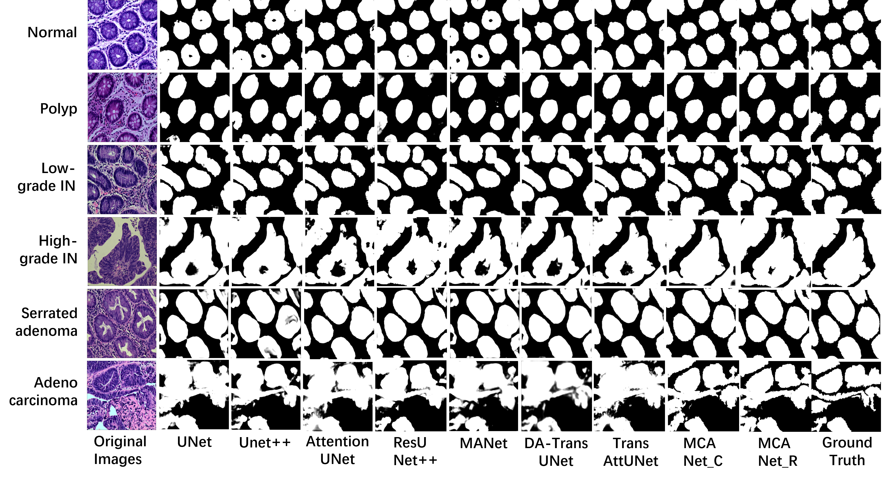

# MCANet

This is the official repository of **Multi-Scale Cross-Dimensional Attention Network for Gland Segmentation.**

# Prepare data
Detailed data is available [here](https://figshare.com/articles/dataset/EBHISEG/21540159/1?file=38179080).

# Some gland image features

Fig1. Our motivation is as follows: the heterogeneity of the glands increases the difficulty of gland segmentation. (a) Normal: normal gland tissue, (b) Low-grade IN: low-grade intraepithelial neoplasia, (c) Adenocarcinoma.

## Model Architecture
The architecture consists of the following components:

Fig2. Illustration of the proposed MCANet for gland segmentation. (a) We design parallel multi-scale attention (PMA) to precisely distinguish between the edge areas of the gland image and other areas. We also design cross-dimensional attention (CDA) to interactively model channels and spatial dimensions in complex gland images. (b) We design multi-scale skip connections to capture the local and global features of glands through cascade connection and residual connection.

### 1. **PMA**
   - We propose parallel multi-scale attention (PMA) mechanism, which preserves pixels' spatial position information through the aggregation of cross-channel and multi-scale information to more accurately distinguish the edge region from other regions of glandular images.

### 2. **CDA**
   - We propose a Cross-Dimensional Attention (CDA) mechanism that captures dependencies across the $(C, H)$, $(C, W)$, and $(H, W)$ dimensions through three separate branches. This enables interactive modeling of channel and spatial dimensions in complex gland images to improve the accuracy of gland image segmentation.

Fig3. The structure of the PMA is shown on the left, while the structure of the CDA is presented on the right.

### 3. **Multi-scale Skip Connection**
   - We design a multi-scale skip connection module to fuse features from different semantic scales. This module not only preserves detailed information but also enhances the model's contextual awareness, enabling effective extraction and fusion of both local and global information for gland image segmentation.

Fig4. The structure of the multi-scale skip connection.

## Performance Comparison (RQ1)

   - As shown in the figure, the segmentation effects of our model and the baseline model are compared.

## Case Study (RQ2)

Fig5. The comparison of segmentation performance on different glad datasets, where the vertical axis represents the datasets and the horizontal axis represents the methods.

## Ablation Study (RQ3)


## Installation

You can install the necessary dependencies using `pip`:

```bash
pip install torch torchvision
```

## Usage
Here is an example of how to use the MCANet for segmentation:
```bash
import torch
from MCANet_C import MCANet_C
model = MCANet_C(n_channels=3, n_classes=1)
```

```bash
import torch
from MCANet_R import MCANet_R
model = MCANet_R(n_channels=3, n_classes=1)
```
